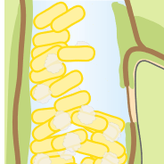
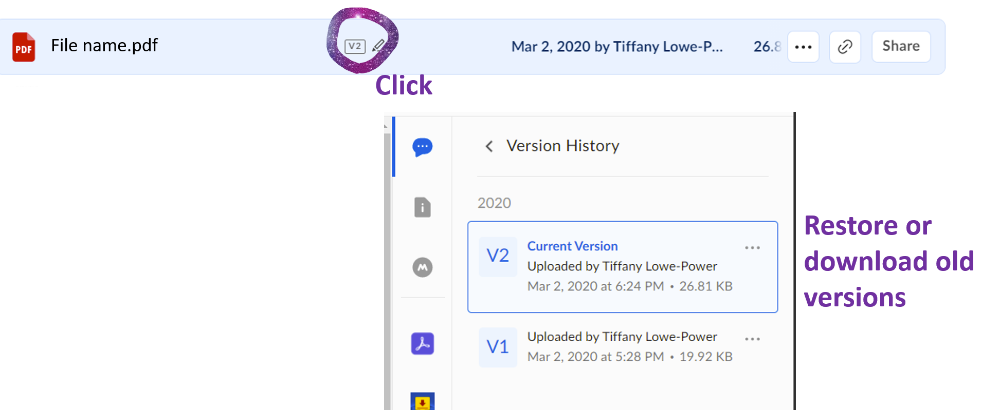

         
    Lowe Power Lab    
    <b>Lab Handbook</b>
 

(Eventually we'll learn how to automatically generate a table of contents here)

# 1. Welcome
You've recently joined the Lowe-Power lab in UC Davis's department of Plant Pathology. We're excited to have you as part of the team!  We look forward to working with you to advance scientific knowledge and making your time in the lab productive and enjoyable. We hope that you'll learn a lot about bacteriology and plant pathology, develop new skills (wetlab, data analysis, writing, presenting), make new colleagues and friends, and enjoy the process while getting to the finishing line. 

This lab manual was inspired by many others and sections borrow heavily from them (including [Aly lab](https://github.com/alylab/labmanual), [Glaunsinger lab](https://glaunsingerlab.berkeley.edu/), [Thrash lab](https://thethrashlab.files.wordpress.com/2013/08/thrash_lab_personnel_expectations.pdf), [Mo Kaze](https://twitter.com/mokrobial)). It's a work in progress.  If you have ideas on content to add, items to clarify, talk to me (Tiffany, the PI). 

This lab handbook is licensed under a [Creative Commons Attribution - NonCommercial 4.0 International License](https://creativecommons.org/licenses/by-nc/4.0/). If you’re a PI or a trainee in a different lab and want to write your own lab handbook, feel free to take inspiration from this one (and cite us!).

# 2. Expectations and Responsibilities

## 2.1. Everyone

*Big Picture*

Science is hard. But it's also enjoyable. In the Lowe-Power lab, we want to make sure everyone experiences a positive, engaging, hostility-free, challenging, and rewarding professional lab environment.  

I think a very important part of my job as a professor is to train and advise students and postdocs. I must contribute to your professional development and progress in your degree. I will help you set goals and hopefully achieve them. In general, I expect you to: 
* Learn how to **plan**, **design**, and conduct high quality scientific research
* Learn how to present and document your scientific findings
* Be **honest**, **ethical**, and **enthusiastic**
* Be *engaged* within the research group and with outside colleagues
* Treat your lab mates, lab funds, and equipment with *respect* 
* Take advantage of professional development opportunities
* Work hard – *don’t give up*!
* *Be kind.* We have a lot of freedom in academia, and I want our lab to be known for using that freedom to be kind.  
* Take care of yourself mentally and physically. 

⮞ **You will take ownership over your training experience**

✔ **Acknowledge that you have the primary responsibility for the successful completion of your degree, fellowship, and projects.** You should maintain a high level of professionalism, self-motivation, engagement, scientific curiosity, and ethical standards. I will provide opportunities to help in reviewing papers and writing grants, you should take these opportunities seriously and participate fully

✔ **Ensure that you meet regularly with me and provide me with updates on the progress and results of your activities and experiments.** Guidelines on meetings are below.      

✔ **Be knowledgeable of the policies, deadlines, and requirements of the program and the university.** Comply with all institutional policies, including academic program milestones, laboratory practices, and rules related to lab safety. PhD students are expected to meet with their thesis committee once per year. It is *your responsibility* to plan these meetings.

✔ **Actively cultivate your professional development.** UC Davis has resources in place to support professional development for students and postdocs. It is important to take advantage of these resources, since becoming a successful scientist involves more than just doing academic research. Aim to attend a weekly seminar. Attendance at conferences and workshops will also provide professional development opportunities. If you find a training opportunity related to particular skill, share it with me and we will try to make it happen.

✔ **Develop your writing and presentation skills.**  As you start to make progress, begin outlining a paper’s figures and drafting the text, especially the *Methods*. Be prepared to go through rounds of revisions before submitting an abstract, poster or paper. Although the availability of travel funds will vary, I encourage everyone to attend at least one conference per year (although it is required that you present a poster or give a talk). Conference abstracts need to be approved by me prior to submission, and we should work on your talk or poster together before it is finalized.  Take full advantage of local opportunities to present your research, including local seminar series, etc. 

✔ **Build your mentoring team.** Everyone needs many mentors with diverse perspectives throughout their career. Once you recognize my strengths and deficiencies as a mentor, seek out additional formal and informal mentors to help you achieve your goals. Seek out diverse mentors: peer mentors, mentors with a shared background, mentors inside & outside of academia. Also, seek out mentees as well. We can grow both by mentoring and being mentored. 

⮞ **You will be a team player**

✔ **Attend and actively participate in all group meetings, as well as seminars.** Participation in lab and group meetings does not mean only presenting your own work, but providing support to others in the lab through shared insight. You should refrain from using your computer, tablet or phone during research meetings (unless you are taking notes). Even if you are using the device to augment the discussion, it is disrespectful to the larger group to have your attention distracted by the device. Do your part to create a climate of engagement and mutual respect.

✔ **Strive to be the very best lab citizen.** 
* Take part in shared laboratory responsibilities and use laboratory resources carefully and frugally. 
* Expect to share strains, reagents, and presentations with your fellow lab members. To make sharing possible and easy, you will maintain a shared up-to-date and organized list of strains, oligos, pertinent sequences and analyses. Maintain open communication with your lab mates over these shared resources. 
* Concerns over authorship, ownership, acknowledging contributions, experimental data etc., should be discussed early and often with all parties.  
* Maintain a **safe** and **clean** laboratory space. 
* Be respectful, tolerant of, and work collegially with all of your lab mates: respect differences in values, personalities, work styles, and perspectives. 

✔ **Support your labmates.** I want everyone to follow the "put your oxygen mask on first model." Prioritize your efforts to your main project(s), but also lend a mind and hands to your labmates when they need help. More details below. 

✔ **Be mindful of conflict and work to resolve it**. Plan ahead and talk about problems before they fester. Be willing to compromise. But if a labmate's actions and behaviors are having negative impacts on you, clearly, kindly, and respectfully communicate this. Be willing to forgive your labmates (adopt a Growth Mindset!). Be willing to listen to your labmates when they share these concerns with you. Be willing to choose your battles -- there is a balance between resolving conflict by redirecting the actions of the others and by accepting the imperfections of your labmates. If you don't have the skills or comfort to do this, part of my/Tiffany's job is personnel management. So please discuss unmanaged problems with me so that I can work with you to solve it.  Working well in teams is a strong *transferable skill* you can develop during your training.  **Recognize that no one is perfect.** 

✔ **Apply for fellowships, awards, and travel grants.**  Not only will an award help your career and the overall lab funding situation, the experience of writing the proposal will help you think about what you are doing more deeply. If you see an award you are eligible for, please let me know and I’ll be happy to nominate you and work on it in collaboration with you. I expect PhD students to make use of the travel funds available through the grad division and department, failure to do so may mean that I will not use lab funds to facilitate your travel. Encourage your labmates to apply for fellowships as well!

⮞ **You will develop strong research skills**

<<<<<<< HEAD
✔ **Maintain detailed, organized, and accurate laboratory records.** You will maintain an electronic lab notebook using the Box cloud service. Your notes should allow your work to be reproduced (meaning they must be understandable by people other than yourself). To write grants to support your work, I need to be able to easily find and understand your data. Be aware that your notes, records and all tangible research data, including sequences and analyses, are property of the lab. When you leave the lab, I encourage you to take copies of your data with you, but one full set of all data must stay in the lab, with appropriate and clear documentation. Early in your tenure, I will audit your laboratory notes to ensure you are recording your data in detail. Please remind me if I forget. Regularly backup your computer data. For more detailed guidelines, see the **"Box Electronic Lab Notebook"** section below.

✔ **Critically analyze your data in a timely fashion.** You will analyze your data shortly after it is collected. This includes performing any mathematical normalizations or conversions and graphically representing the data in a publishable format (using Graphpad Prism or R). I expect you to critique the data -- did the experiment perform as expected (i.e. similar to results obtained previously in the lab as shown in our publications and electronic lab notebooks?). If you are not sure about the data, please bring it up to me and labmates ASAP, so that we can set priorities for troubleshooting. You should come to 1:1 meetings with me (Tiffany) with analyzed data to discuss the results and future directions. 

✔ **Keep up with the literature so that you can have a hand in guiding your own research.** Block at least one hour per week to read papers. You are expected to keep on top of both current and past literature related to your project.  Because of the volume of individual research projects in the lab and my other teaching and administrative duties, I do not have the bandwidth to be on top of all of the literature for everyone’s project. I expect you to be the expert! Please use the #reading-club Slack channel to forward me papers you come across that you think are particularly relevant, and I will do the same. To help yourself, set up keyword searches through PubMed or Google Scholar alerts.  Consider using Twitter professionally (following scientists & contributing to public discource), but make sure it doesn't distract you from your work. 

✔ **Prepare scientific articles that effectively present your work to others in the field.** The ‘currency’ in science is published papers, and we have an obligation to funding agencies to complete and disseminate our findings. I will push you to publish your research as you move through your training program, not only at the end. PhD students will be expected to be lead author on at least 2 research manuscripts. Time and opportunity permitting, consider adapting the introduction to your PhD thesis into a Review / MiniReview. Similarly, postdocs should aim for at least 2-3 first author papers. We will deposit all our manuscripts on a preprint server like bioRxiv at the same time as we submit them to a peer-reviewed journal. We will identify journals/publishing companies that are consistent with the lab's values (e.g. we will favor Society journals [ASM, APS, ASPB] and open access journals [PLoS, eLife, PeerJ] and avoid Elsevier, MDPI, and similar journals).

✔ **Acknowledge that performing experiments and using lab resources is a privilege**. Scientists have to be careful. Don't rush your work.  **Plan** it. **Organize** it. If performing a new protocol, walk through the steps. Everyone makes mistakes and gets overwhelmed, however, if your records and analyses are not getting the attention needed to ensure reproducibility then your use of lab resources will be put on hold. 
=======
✔ **Prepare scientific articles that effectively present your work to others in the field.** The ‘currency’ in science is published papers, and we have an obligation to funding agencies to complete and disseminate our findings. I will push you to publish your research as you move through your training program, not only at the end. PhD students will be expected to be lead author on at least 2 research manuscripts. Time and opportunity permitting, consider adapting the introduction to your PhD thesis into a Review / MiniReview. Similarly, postdocs should aim for at least 2-3 first author papers in a 2-3 year postdoc. We will deposit all of our manuscripts on a preprint server like bioRxiv at the same time as we submit them to a peer-reviewed journal. We will identify journals/publishing companies that are consistent with the lab's values (e.g. we will favor Society journals [ASM, APS, ASPB] and open access journals and avoid Elsevier journals).

✔ **Keep up with the literature so that you can have a hand in guiding your own research.** Block at least one hour per week to read papers. You are expected to keep on top of both current and past literature related to your project.  Because of the volume of individual research projects in the lab and my other teaching and administrative duties, I do not have the bandwidth to be on top of all of the literature for everyone’s project—I expect you to be the expert! Please forward me papers you come across that you think are particularly relevant, and I will do the same. To help yourself, set up keyword searches through [PubMed](https://www.ncbi.nlm.nih.gov/guide/howto/receive-search-results/) or [Google Scholar alerts](https://academicanswers.waldenu.edu/faq/134432).  Consider using Twitter professionally (following scientists & contributing to public discource), but make sure it doesn't distract you from your work. Also, make sure that Twitter/science social media does not detract from your mental health. If you are struggling with your project, Twitter can amplify negative feelings. 

✔ **Maintain detailed, organized, and accurate laboratory records.** Your lab notebook, notes, data, and analysis are the property of the lab. You will maintain an electronic lab notebook. Your notes should allow your work to be reproduced (meaning they must be understandable by people other than yourself) and will help to assign credit for authorship. They are required by funding agencies and for any potential patents. Be aware that your notes, records and all tangible research data, including sequences and analyses, are property of the lab. When you leave the lab, I encourage you to take copies of your data with you, but one full set of all data must stay in the lab, with appropriate and accessible documentation.  Regularly backup your computer data. 

✔ **Acknowledge that performing experiments and using lab resources is a privilege**. Scientists have to be careful. Don't rush your work.  Plan it. Organize it. If performing a new protocol, walk through the steps. Everyone makes mistakes and gets overwhelmed, however, if your records and analyses are not getting the attention needed to ensure reproducibility then your use of lab resources will be put on hold. When starting something new, plan a trial experiment to practice a technique or to get familiar with working with an organism. You cannot
>>>>>>> 6693f3ed337850a14a278b1baf7268f2b97d39df

⮞ **You will communicate clearly**

✔ **Remember that all of us are “new” at many points in our careers.** If you feel uncertain, overwhelmed, or want additional support, please overtly ask for it. I welcome these conversations and view them as necessary. Build community within the lab and reinforce this philosophy with new and existing lab members

✔ **Include Tiffany on all communications regarding your any lab research (yours or others).** This includes cc'ing me on emails and making me aware of any conversations outside of email.  Basic research inherently is a competitive environment. We will be open about our work among colleagues, but we need to be mindful about what we share, when we share it, and with whom we share it. If you are unsure of what level of detail you can describe to whom, please ask me about it in advance. 

<<<<<<< HEAD
✔ **Let me know the style of communication or schedule of meetings that you prefer.** If there is something about my mentoring style that is proving difficult for you, please tell me so that you give me an opportunity to find an approach that works for you. No single style works for everyone; no one style is expected to work all the time. Do not skip meetings with me if you feel that you have not made adequate progress on your research; these might be the most critical times to meet. When you join the lab and at annual IDP meetings, I ask that you fill out the [Workstyle Questionaire](https://forms.gle/i8mJ7ZLnuKyRjQfBA)
=======
✔ **Let me know the style of communication or schedule of meetings that you prefer.** If there is something about my mentoring style that is proving difficult for you, please tell me so that you give me an opportunity to find an approach that works for us. No single style works for everyone; no one style is expected to work all the time. Do not skip meetings with me if you feel that you have not made adequate progress on your research; these might be the most critical times to meet.
>>>>>>> 6693f3ed337850a14a278b1baf7268f2b97d39df

✔ **Communicate your data with integrity.** It is never okay to plagiarize, tamper with data, make up data, omit data, or otherwise fudge results.  We don't generate data to prove our favorite hypothesis.  We perform science to find out the truth by forming testable hypotheses and rigorously and critically testing the hypotheses. 

## Principle Investigator
What you should expect from me 

✔ **I will set the scientific trajectory for the lab and provide the means to pursue those directions.**  This will include helping you to find a research topic, writing grants to fund the research, and seeking out collaborators for our work and to further your opportunities.

✔ **I will have high expectations of you**. I will practice kindness while pushing you to meet high expectations. In this lab, we will practice the [Growth Mindset](www.mindsetscholarsnetwork.org/learning-mindsets/growth-mindset/). Everyone comes into lab with a unique background and a unique combination of skills and expertise.  The commonality is that we all have room to grow our skills and expertise while pushing scientific knowledge forward. I ask you to be thoughtful about what to grow, when to grow it, how to grow it (what resources are available from me, the department, the university, the internet?). You will guide your own growth. Sometimes this growth will be easy and quick. Other times it will be challenging and hard-earned. 

✔ **I will be available for regular meeting and informal conversations.** My schedule often requires that we plan in advance for meetings. However, I also welcome informal discussions, so feel free to come in anytime my door is open. (*Note* We will see how well this works. The location of my office on a main hallway, which may make it difficult for me to work with the door open.)

✔ **I will provide timely feedback** on your project ideas, conference posters, talks, manuscripts, data, and grants. Provide me with 1-2 weeks to give you feedback on your work.

✔ **I am committed to mentoring you now and in the future.**  I am committed to your education and training while in my lab, and to advising and guiding your career development. I will support your career development by introducing you to other researchers in the field, promoting your work at talks, and writing recommendation letters for you. I will help you prepare for the next step of your career, whether it's a post-doc, a faculty job, or a job outside of academia. 

✔ **I will discuss data ownership and authorship policies regarding papers with you.**  These can create unnecessary conflict within the lab and among collaborators. It is important that we communicate openly and regularly about them. Do not hesitate to voice concerns when you have them.

✔ **I will encourage you to attend scientific/professional meetings.**  I will not be able to cover all requests but you can generally expect to attend at least one major conference per year when you have material to present. Securing outside funding (e.g. a fellowship or travel award) will likely enable you to attend additional meetings. I will work together with you to strengthen your presentation skills.

<<<<<<< HEAD
✔ **I will strive to be supportive, equitable, accessible, encouraging, and respectful.**  I will try my best to understand your unique situation and mentor you accordingly.  I am mindful that each trainee comes from a different background and has different professional goals. It will help if you keep me in formed about your experiences.
=======
✔ **I will strive to be supportive, equitable, accessible, encouraging, and respectful.**  I will try my best to understand your unique situation, and mentor you accordingly.  I am mindful that each mentee comes from a different background and has different professional goals. It will help if you keep me informed about your experiences.
>>>>>>> 6693f3ed337850a14a278b1baf7268f2b97d39df

## Post-Docs
In addition to the general expectations above, you are expected to

* Develop your own independent line of research.
* Identify portions of your research that can be delegated to undergraduate researchers on a mentored research projects. I (Tiffany) will help you recruit motivated undergraduates to work with you.
* Train and mentor graduate students in the lab when they need it.  Either because they ask, I ask, or you see the need. 
* Apply for grants (USDA NIFA, NSF, LSRF, or others). Although I will only hire you if I can support you for at least one year (and ideally 2 years), it is in your best interest to get independent funding.  Even if you don't get funded, grant writing provides you motivation to formalize your research ideas and solicit feedback. 
* Apply for jobs (academic or non-academic) when you are ready, but no later than the beginning of your 4th year of post-doc.  
* Challenge me (Tiffany) when I am wrong, when you have a difference of opinion, and share your expertise with the lab. 
* Contribute to lab chores (Tiffany will divide duties equitably).
* Represent the lab with pride and integrity, and show respect for others.  You are now an ambassador for the lab as well as a member.  Our reputation will be partially formed by how you interact with other colleauges. 

## Graduate Students
In addition to the general expectations above, you are expected to

* Generally maintain a positive, solution-oriented attitude
* Cultivate your curiosity about the work you do and think creatively
* Actively participate in all laboratory group functions
* Be responsible for your own productivity and schedule, and maintain flexibility in your schedule during emergencies and crunch times.
    * Prioritize time for research.  Coursework and TAing are important, but ultimately your research gets you your PhD and prepares you for the next stage of your career.  
* Develop your dissertation research with my input. Your dissertation should have at least 2 substantial products (papers) that address an important scientific question.  Much of the work must be completed independently (even if it is collaborative), but others in the lab are available to help you.
* Identify portions of your research that can be delegated to undergraduate researchers on a mentored research projects. I (Tiffany) will help you recruit motivated undergraduates to work with you.
* Apply for fellowships/grants at every eligible opportunity (NSF GRFP, USDA NIFA, etc). Even if you don't get funded, grant writing provides you motivation to formalize your research ideas and solicit feedback. 
* Grow to be the expert in your domain.  Challenge me (Tiffany) when I am wrong. 
<<<<<<< HEAD
* Contribute to lab chores.  Tiffany will divide duties equitably.
=======
* Contribute to lab chores (Tiffany will divide duties equitably).
>>>>>>> 6693f3ed337850a14a278b1baf7268f2b97d39df
* Represent the lab with pride and integrity, and show respect for others.  You are now an abassador for the lab as well as a member. Our reputation will be partially formed by how you interact with our colleagues. 

## Undergraduate Students
As an undergraduate in the Lowe-Power lab, your first priority is school.  We are happy to have you and excited for your to progress in your experimental skills, but your degree responsibilities come first.  The lab supports your efforts to succeed scholastically at UC Davis, and working in the lab should enhance those efforts, not detract from them.  If you can be successful in school AND have time to work in the lab, while you are here you are expected to:

* Generally maintain a positive, solution-oriented attitude
* Ask questions. Cultivate your curiosity about what you're working on, why you're being taught something, how what you're doing fits into the larger picture, and make sure you've cleared up any confusion about a task *before* beginning. 
* Maintain and treat all lab equipment with care
* Actively participate in whatever laboratory group functions you can attend. 
* Adhere to the agreed upon schedule of work hours, and be available and willing to work beyond it in emergencies except,
    * If scheduling conflicts arise. In this case, be proactive and communicate effectively with me and other depending on you.
* Remain focused an task-oriented while working (e.g. avoid cell-phones, social media, and other distractions)
* Maintain a legible, organized, and fully-updated lab notebook in OneNote.
* Look for and submit fellowship/scholarship applications to receive funding. 
* Include Tiffany and other mentors on all communications regarding lab research (yours and others'). Basic research can be a competitive environment, so we ask that you are thoughtful about what details you share about our work.  If you are unsure of what you can share and with whom, please ask your mentor or Tiffany. 
* Represent the lab with pride and integrity, and show respect for others.  You are now an ambassador for the lab as well as a member.  Our reputation will be partially formed by how you interact with other colleauges. 
* Contribute to lab chores (making media, sterilizing tips, cleaning work areas).
* Have fun and get excited about contributing to new discoveries about life!

## Authorship Guidelines

The trainee that contributes the most to a project can expect to be the first author of published work, and Tiffany will typically be the last author. Students and postdocs who help over the course of the project may be added to the author list depending on their contributions, and their placement will be discussed with all other authors. If a trainee takes on a project but subsequently hands it off to someone else, they likely will lose first authorship to the person they pass it on to, unless co-first-authorship is appropriate.

If you leave the lab with unpublished work, you should talk to Tiffany about whether you plan to continue to work with her to write it up and manage experiments needed for revision after leaving, or if the final project write-up and revisions should be reassigned to another lab member. In this case, we will revisit authorship questions to determine whether you will retain first authorship, or if the lab member who completes the publication will become first author. If the unit requires significantly more labwork to confirm / support the results, then first-authorship might be passed to a current lab member. Authorship will depend on how much more needs to be done to get the research into a publishable form.

# Code of Conduct

The Lowe-Power lab is a collaborative team of scientists to work together to advance knowledge and understanding of our natural world.  We are committed to creating a welcoming and respectful place for learning, teaching, and contributing.  We value ideas, open minds, hard work, and fun. All members and guests of our lab are expected to demonstrate respect and courtesy to others.  We treat physical and emotional safety seriously. 

The Lowe-Power lab is a positive and professional environment where we use welcoming and inclusive language, are respectful of different viewpoints and experiences, do our best to provide and gracefully accept professional constructive criticism, and focus on what is best for our lab community.  Science can be stressful and difficult. Although you will experience frustrating and emotionally challenging days in the lab, continued courtesy and respect towards others is expected.  If you falter, sincerely ask for forgiveness from your labmates. 

We recognize that some groups in our community are subject to historical and ongoing discrimination and may be vulnerable or disadvantages.  Membership in such a specific group can be on the basis of characteristics such as citizenship, disability, ethnic or social origin, familial status, gender identity, nationality, physical appearance, pregnancy, race, religion/spiritual beliefs, sex, sexual orientation, socioeconomic status, or veteran status. We do not tolerate harassment on the basis of these categories, or for *any* other reason.  Harassment is any form of behavior that excludes, intimidates, or causes discomfort. We will not tolerate intimidation, stalking, following, unwanted photography or video recording*, sustained disruption of talks or other events, inappropriate physical contact, and unwelcome sexual attention.  This applies within and outside of the lab. 

*Ask for permission before posting candid photographs/videos of labmates to social media or in talks.  If using a photo of a labmate in a talk to credit their work, use the photo they approved for the lab webpage or another professional social networking site, or otherwise ask for their permission. 

# Computing & Software recommendations

While the budget allows, full-time labbies (postdocs, grad students, and junior specialists) will be issued a computer that is in line with their research needs. Budget will be $1k, and it will be a Windows machine. Desktops can be configured for you to remote-into the machine if you are more productive writing/analyzing data from home/coffee shop/library.  However, it will be better for lab dynamics if you are physically present in lab when possible. 

I encourage the use of Windows platforms for compatibility with the lab.  But ultimately, the choice is yours. 

**Essential Software**

**Box Drive**. For cloud back-up of lab files.  See section on Box above for more details. 

**Slack Desktop Client** and **Slack Phone App** for lab communication

**Graphpad Prism**. We have annual lab licenses for computers of full-time staff.  We use this software for graphing & basic statistics. Access to their [statistics guide](https://www.graphpad.com/guides/prism/8/statistics/index.htm) is free for everyone. We'll try to install Graphpad onto a shared computer for use by undergraduates. 

**Affinity Designer**. Vector-based graphics software.  Way cheaper than Adobe Illustrator/Photoshop ($50 license). Lab will pay for licenses for lab issued computers. Contact the Phoenix Cluster IT to ask for a license (CC Tiffany)

** Benchling.com ** (Only available via the website. No installation.)
* Benchling will be our lab's cloning / primers / short DNA management software.  
    * Create an (academic) account and request access to the organization: https://benchling.com/organizations/lowepowerlab/members
    * Information on the organization of our lab Benchling is on our lab GitHub protocols: http://lowepowerlab.ucdavis.edu/protocols/benchling_tips.html
    * Keep "cloning plans" in your Box lab notebook. These should be word documents that include screenshots from PrimerBlast/NEBuilder and other websites. This will help you problem-solve your cloning if it goes wrong. For advice on designing cloning projects see protocols like http://lowepowerlab.ucdavis.edu/protocols/gibson_assembly.html 
    * Your primers should be stored both as an Excel spreadsheet and uploaded to your subfolder in `1-oligos` on Benchling

**Reference Management Software**. We prefer Paperpile as a reference manager. It integrates excellently with Google Scholar (import of papers), MS Word, and Google docs. **warning**: Citations rarely import correctly into the software.  Before submitting fellowships, prelim proposals, or manuscripts, carefully proofread the citations. Correct them in the Reference Management Software. 

**Useful Software/tools**

* [ACD Chemsketch](https://www.acdlabs.com/resources/freeware/chemsketch/) - Chemistry drawing program. (There's also a UCD license to ChemDraw, but it's a very bloated program & you probably don't need all the features.)

* [BioRender](https://biorender.com/) -- Quick biology diagrams. Unfortunately, they only export as JPGs on the free version. You should avoid JPGs for graphs / text / cartoons because of the compression.  PNG and TIFs have better compression for line-art. 

**GitHub Desktop** and **Visual Studio Code (VS Code)**.  A text editor that interfaces excellently with GitHub. [See information for configuring here](https://github.com/lowepowerlab/protocols/blob/master/git_and_github.md#set-up-a-text-editor-on-your-computer)

**RSS Feeds**.  Use PubMed digests, Google Scholar alerts, or another method to keep up with the literature that is relevant to your project. 

# Lab Resources and Expectations for Data Management

Tiffany and the lab will post resources to the [lab webpage (Resources Subpage)](http://lowepowerlab.ucdavis.edu/resources/). Feel free to add resources you discover yourself. Consider advertising them to the Slack as well. 

## Emergency Contact sheet

Enter your contact information into the [Lab Contact Sheet](https://cutt.ly/lpl_contact). Save your labmates' phone numbers in your phone in case of Emergency.  Ask for permission to use the phone numbers for personal/social use and respect your labmates' wishes. *Do not use the phone numbers for harassment of any sort*. 

## 4.2. Box Electronic Lab Notebook

Our lab keeps open lab notebooks that are automatically synced to our shared "LPLab" folder on [Box at ucdavis.box.com](ucdavis.box.com) (using Box Drive). Details below. 

**Lab Notebooks** are property of the lab and will digital and be backed up regularly. 
* Notebook should be completed by the end of the week. 
* Notebook should be backed up monthly to the cloud (automatically preferred, especially with Box Drive).
* Although your data is the property of the lab, a digital lab notebook is in your best interest.  You'll always be able to look back at the methods you optimized & potentially write your papers on a beach / coffee shop / ski lodge in Tahoe. 
* **File Name conventions**. Label lab notebook entries as "YYYYMMDD - [Some keywords about the entry]".  Example: "20210405 - Cloning Plan - KO geneA in GMI1000". You want the file name to help you and a labmate find your data efficiently. The YYYYMMDD date format because this will let computers sort it in order and it's an equal learning curve for US (MMDDYYYY) and international labbies (DDMMYYYY).

When graduate students/postdocs join, I will create a "nb-[yourname]" subfolder.  This is your lab notebook. I will populate your notebook with a suggested folder registry and example files. All of your planning documents, raw data, analyzed data, and notes should be uploaded to your notebook ASAP (or within 7 days at the most). Your data is the property of the lab, and it must be backed up. Your data must be open and understandable to Tiffany and your labmates. 

Additionally, you will be issued a RocketBook, which is a Reusable Notebook that you can use to take notes at the bench. You can set Rocketbook up with your Phone and Box so that you can take photos of each page and they will automatically upload to your digital lab notebook. [Link to the current lab notebook model](https://www.amazon.com/Rocketbook-Everlast-Fusion-Letter-Size/dp/B07RTN4F7D/)

1. Install the Box Drive software on your computer. 
1. Get Access to the `LPlab` folder. *Ask anyone in the lab to grant you this access*
1. Create a `nb-LastnameFirstname` folder within it. Set this folder to Sync to your computer(s). Use this to store all of your lab notebook files in a reasonably organized way.
    * Large datasets will be backed up on external harddrives.
1. Explore the `1-shared` folder, which has many lab and professional development resources. You probably want to Sync this folder to your computer.
    * The `1 - Meeting reports` subfolder contains all lab meetings for each person in the lab. Additionally, I encourage you to bring an agenda (ideally with data to discuss) to your weekly 1:1 meetings with me. 
    * The `1 - be organized` subfolder contains examples of data collection sheets, and other advice for keeping your research organized. 
    * The `1 - Presentations (warning, large folder)` subfolder contains every Qualifying Exam, research poster, and research talk that Tiffany or a lab member has presented. Feel free to build from these resources. 
    * The `1 - Useful Images & video (for presentatations)` subfolder contains cartoons and photos that you might want to use when presenting research.  Please add to this!
    * The `1 - Lit, old papers` subfolder contains historic literature on Ralstonia that is hard to access online (pre 1970s). Many of these papers have important insight about the ecology of Ralstonia. 
    * The `1 - protocols` folder contains some protocols, but I want us to keep our [protocols open on our lab Github](https://github.com/lowepowerlab/protocols) as a resource to our colleagues. 
    * The `2 - Ralstonia Datasets` subfolder contains many useful datasets, like Average nucleotide identity (ANI) comparisons of Ralstonia genomes, published transcriptomics datasets, and more. If you are working with a certain set of genes, I encourage you to investigate the expression of those genes in different conditions.

 You are allowed/encouraged to maintain access to your data after you leave the lab.  This will help you wrap up final manuscripts. 

### Good things about Box:
* **Version-Control** -- (Tiffany) accidentally deleted 40 pages of my PhD thesis without noticed & then saved changes.  Because I was working from a Box-synced folder, I was able to go back to the web interface of Box and download previous iterations of my thesis to find that text. 
    
* **Shared-Access** -- Our projects build on the methods and data generated by others in the lab. Additionally, Tiffany is often writing grants to support your projects.  Immediate access to your data helps us be more efficient. 

### Drawbacks of Box:
* It only syncs one folder. For this reason, save *all* of your lab material in that folder
* **Sync Speed** -- it can be slow to sync files (minutes). 
* **Multiple People Issues** 
    * If 2 people have a document open, edit it, & save their changes, box creates 2 files that a human then has to manually merge the changes. This is most likely a problem when co-writing a paper with your PI. If it's a word Doc the "Compare" feature in "Review" can cut down on how annoying this problem is. 
    * Be conscious when deleting synced files / folders on your personal computer. 

## Slack

**Slack will be our lab's preferred communication tool** to keep it separate from noisy email boxes. I encourage labbies to install the Slack desktop app and smartphone apps and create an account to access [LowePowerLab.slack.com](LowePowerLab.slack.com). Everyone should set "Quiet Hours" when Slack will not push notifications to your phone. You are not expected to respond to lab communication during evenings and weekends. 

***Important notice***. We use the free version of slack, which limits us to the most recent 10k messages (paid plan is $7/person/month, which is not scalable).  Therefore, assume any communication will be locked up eventually. When sharing important files, either use email (permanent) or upload the files to Box Sync and use the Box integration in slack. 

**Channels**. In Slack, group communication is organized into # channels. Not all channels will be default, but you can click on "Channels" to add yourself to channels. We may create project-specific channels that only require participation of a few lab members, but everyone else is expected to keep up with the default channels.

**Channels vs. Direct messages.** Try to keep channels on topic so that people can subscribe only to the channels that are relevant to them. For messages to one person or a small group, use direct messages. If you have to send messages to members outside of the lab, use email. 

If there's an emergency, and Tiffany isn't responding on Slack, email her.  If it's a very urgent emergency (lab accident, -70 freezer meltdown, etc), call 911 or [Tiffany's Cell Phone](https://cutt.ly/lpl_contact). 

**Purposes of Channels**
* **# general**:
    * Post lab business here: new resources, etc.  The lab calendars will automatically post lab events/travel to this channel on Monday mornings
**# labmeeting_journalclub**:
    * The lab meeting schedule will be posted here each quarter. 
    * Organizing journal club
    * Posting paper (1 week before the JC)
**# celebrations**:
    * Celebrate science and/or life things here!
**# lab-management**: A place to discuss lab management type questions and/or updates.  Recent examples include: a warning that the incubator is running warm and needs to be calibrated, a request for someone to make media because we are running low, a picture of an area that was re-organized for a better work flow. 
* **# safety**:
    * A place to discuss safety: Identify hazards, ask safety related questions, share safety information & advice!
**# ordering**:
    * Post items that need to be ordered.  Assume it will take > 1 week for anything to arrive, so plan out early!
        * Include **product #** and **Manufacturer**
        * Whoever has the "ordering" lab duty will submit orders & mark them with a checkmark emoji. 
* **# failure_upwards**: In science, most effort and time is spent troubleshooting experiments that are not working, therefore we are always failing upwards. In this channel,
    1. Seek troubleshooting advice, especially for lab-specific technical questions.  For general molecular biology/genetics, also consider the [labrats subreddit](reddit.com/r/labrats) or [ResearchGate](Researchgate.com).  ResearchGate seems better for searching old discussions & labrats is better for active discussion. 
    1. Poke fun at your own failures.  Failure is an essential part of research, but it is easy to forget that when reading scientific papers / listening to seminars that are the culmination of a lot of failure that eventually led to success.  To bolster our lab against **imposter syndrome**, I encourage everyone to acknowledge failures. 
    1. Share exciting results with your labmates!
* **# plant_cam**: Photos from the growth chamber.  Post pictures of abnormal plants to ask if it indicates a co-morbidity (damping off, thrip feeding damage to leaves, etc.).  If you have extra seedlings and there is space in the growth chamber, advertize them to your labmates here!
* **# undergrads_all**: A space for undergraduates. Tiffany often posts upcoming opportunities like the Undergrad Research Conference or PUF fellowship deadlines to this channel. 
* **# random**:
    * This is the off topic area for jokes, memes, free food announcements, etc. 

There are multiple project based channels as well!

Some of the resources I share on slack will be Tweets.  Even if you don't want to use Twitter professionally, I recommend making a private account so you can easily view these. 

## Inventories and Lab Google Drive

Many of our lab inventories are shared on the [Lab Google Drive](https://drive.google.com/drive/folders/0ABFY5SVtff9dUk9PVA). If you don't yet have access, you can request access via that link. 

Important shared documents include:
* Strain List (Google Sheet)
* Ordering Sheet (helpful for buying consumables. This also has our lab accounts to idt and other sites). Orders are placed through AggieBuy or Prepurchasing. 
* Emergency Contact Information
* RB-TnSeq Metadata
* Lab Meeting Schedule

### More details on Strain lists
**Work-In Progress strains/plasmids** should be kept in personal freezer boxes, which is a short-to-medium term storage. 

**Core Strain inventory**. Once validated I expect strains & plasmids to be added to the core strain inventory (detailed in the ["Glycerol stocks" lab protocol](https://github.com/lowepowerlab/protocols/blob/master/glycerol_stocks.md)). All validated plasmids should be added to a core folder on the lab's Benchling account. 
    * I encourage everyone to do monthly audits of their strains and make sure any confirmed strains are moved to the permanent collection & incorrect strains are put in biohazard waste. 

## Protocols
Most **Lab protocols** are hosted on Github: https://github.com/lowepowerlab/protocols. 
    * Create a Github account for yourself and apply for an [academic account](https://help.github.com/en/articles/applying-for-an-educator-or-researcher-discount) to have the option of private repositories. I expect all repositories to be shared within the lab and any validated data or protocol to eventually be publicly published and shared with the scientific community. 
    * As we optimize/improve/change protocols, please commit updates to the shared lab protocols, and list yourself as a contributer. 
    * Github allows us to have version control on protocols, so it's possible to retrieve previous versions of protocols. 

Some protocols may be located in the 1-Shared folder in Box Drive (especially if we receive them from colleagues & haven't adapted them to our GitHub format.)

### GitHub

Our lab has a GitHub organization.  Create a professional GitHub account (I encourage you to use something with your real name) and request to join the LowePowerLab Organization [github.com/lowepowerlab](https://github.com/lowepowerlab). 

Install the Github Desktop Client and Visual Studio Code to manage an update the [lab protocols](https://github.com/lowepowerlab/protocols), lab website (see the [Public Face](http://lowepowerlab.ucdavis.edu/)) & the ([Repo behind the scenes](https://github.com/lowepowerlab/lowepowerlab.github.io), and your private repositories (e.g. not yet ready for public eyes) shared with the lab. 

The lab protocols are written in GitHub Markdown Syntax. It's easy to pick up & google for more ideas. 

The lab website uses a similar Markdown and is built on a "Jekyll" platform with the "Minimal Mistakes" theme. Googling for these can help you add elements to the web pages. But when in doubt, copy the syntax from the page. 

## Google Calendars
The lab has a few Google calendars on the shared account: LowePowerLab@gmail.com (ask a current lab member for the password).  You can share these with your @ucdavis & personal Google Cals with "make changes to events" permissions. 

1. **L-P lab-Events** calendar: keep track of lab events like lab meetings, journal clubs, retreats, and lab members' birthdays.  *This calendar posts weekly and daily to #general on Slack.*
1. **L-P lab-Travel** calendar: Indicate your travel dates (e.g. "Tiffany away" for Aug 1-7) so that people know when you aren't available. It's important to know if only 1 or 0 people will be present in lab in case we receive a shipment of enzymes on dry ice--we'll need to ask a neighbor lab to receive them.  *This calendar posts weekly-Monday to #general on Slack.*
1. **L-P lab-Class time** calendar: **As soon as you register for class, please update this calendar for the next quarter.** This applies to undergraduates too!  Tiffany uses this calendar to find a concensus time when lab meeting can be held.  We try to hold lab meeting at a time when all members, including undergraduates, can attend.  However, sometimes we have to choose a time when someone has class.  
1. **L-P lab-Seminars** calendar: Add interesting seminars to this calendar. Make sure to include room location in the event. *This calendar posts weekly-Monday to #general on Slack.*  Also feel free to post last-minute notices about seminars directly into the #general slack. Aim to attend avg ~1 seminar / week in the academic year. 

### **Seminar series include:**
Obviously we cannot spend the whole week in seminar. However, each of these lists may contain seminars of interest to our multi-disciplinary research group.

* **Plant Pathology aka PLP-290**: http://plantpathology.ucdavis.edu/GradSeminars.cfm
* **Microbiology & Molecular Genetics** aka MIC-291: https://mmg.ucdavis.edu/calendar
* Integrative Genetics & Genomics: https://igg.sf.ucdavis.edu/all-events
* Plant Science Seminar series. (Often more ecosystem scale plant biology): https://www.plantsciences.ucdavis.edu/plant-sciences-seminars
* Ecology and Evolution: http://eve.ucdavis.edu/seminars.html
* Plant Biology Grad Group (often more molecular scale plant biology): https://pbi.ucdavis.edu/all-events

* Medical Microbiology aka MMI 291 (often has a strong vertebrate animal immunology focus): https://health.ucdavis.edu/medmicro/seminars.html
.  

## Data Management

**Recommended Reading list**
(This is out of date, but might be useful).

We have a hive-mind Google Doc that will morph as the lab interests ebb and flow. This document will serve as a potential starting point for new lab members to dive into the literature.  While a lot of the papers are *Ralstonia* related, we'll also put in other bacteria/microbe-interactions papers that might inspire our work.   

You can request read (part-time labbies) and edit (full-time labbies) access to the [Recommended Reading doc here](https://docs.google.com/document/d/1P-1xsSmAvdl-zBIPTzegvSQwl7Bo9lA3qmXo16owYDA/edit#heading=h.jhbq16rd80b).

## Recommendation: make a Google Chrome Profiles for your @ucdavis.edu account
You will use your @ucdavis.edu account to access a lot of services at Davis (email*, shared drive, Box Sync, Google Calendars, etc).  I recommend configuring your Google Chrome Browser to have  several "profiles". [Details here until this link becomes outdated](https://www.howtogeek.com/207614/everything-you-need-to-know-about-google-chromes-profile-switcher/)
1. Your @davis.edu account
1. Your Personal Google account
1. *Maybe* LowePowerLab@gmail.com account -- *Or you can share each lab calendar with your @ucdavis account with "make changes to events" permissions*

*I had to request specific access to a gmail email interface called *DavisMail*.  If you also don't want to use the Outlook interface, contact [Phoenix IT](https://phoenix.ucdavis.edu/PITS/Help_Request_Ticket) and ask to be transferred to gmail.

# General Policies

## Hours

The main gist is -- the specific hours worked don't matter as much as whether you are being personally productive & promoting lab community by supporting your labmates.

I expect that everyone meets a minimum of 40 working hours.  While there is considerable flexibility in academia, I encourage you to generally aim to be on campus/in lab for M-F for +/- 9 am - 5 pm. If this doesn't work for you because of outside commitments or other reasons, please feel free talk to me. However, you are responsible for setting your own schedule and being productive with your time. I ask you to be willing to work weekends and evenings when necessary.  During emergencies or crunch times, I ask you to be flexible, available, and willing to work beyond your personal schedule. 

Being physically present in lab is helpful for learning from others, supporting others, building community, and having fast and easy access to resources/people that you need.  It also removes some of the distractions of your home (e.g. Netflix, your cats, and all the cleaning you could accomplish instead of writing).  However if you're in a writing-intensive portion of research (Grants, manuscripts, etc.), and you're more productive in a coffee shop/library/back porch, then you-do-you.  Even still, try to at least have some face-time in lab/office every day. Slack can help, but a real conversation is often more efficient/effective.  

**Absences/Vacation.** I expect that you will take vacation and that you may need to adjust your work hours for deadlines or because you need a break. Please notify me (and fellow lab members) in advance of planned absences using the lab calendar (LowePowerLab - Travel). I believe that work-life balance and vacation time are essential for creative thinking and good health, but it helps if everyone knows if you will be absent. If you are unexpectedly unable to come to lab, or will be *unusually* late please let me know as I will likely worry otherwise.
* If you have significant out-of-office/lab obligations, clear them with me. To help your labmates know when they can get your help in lab, consider using your personal Google Calendar the way I do: [Share a free/busy link to your calendar in your email signature](tinyurl.com/tlp-avail). 
* Finally, keep in mind that our experiments of involve growing and maintaining plants, which means you will often have to pop by the growth chamber to water plants on the weekend or exchange lab favors with a labmate to cover your plants for you. **You are responsible for asking labmates to cover your work and providing them clear instructions to complete it accurately**

**Evening/Weekend Emails/Slacks**. Respect your labmates work-life balance.  While we're all free to send messages in the evenings/weekends, we are under no obligation to respond to them unless there is a *rare* emergency or deadline. If these crunch times can be anticipated, I will try to coordinate this in advance with you. All this said, I realize that being told you can ignore my messages might not take away the stress of *seeing* my messages if you check your email/Slack in the evenings/weekends.  If my off-hours messages are unwelcome and cause distress, please talk to me, and I will work to not bother you during your off time. 

While I will sometimes work weekends and holidays, I try to only do that when necessary. Please respect that by making sure to give me sufficient notice about impending deadlines so that I can get things done for you (e.g. write letters of recommendation, provide feedback on manuscripts/proposals, etc) while maintaining my work/life balance.

When I work weekends/holidays, I will avoid entering the lab or otherwise observing whether anyone is working in the lab. I don't want there to be subtle pressure to get *bonus points* because the boss saw you working on the weekend.  That pressure can get toxic, fast. 

## Safety

Lab safety is not just checking off the training you complete at the time of onboarding & at annual frequencies.  It is a culture. It is upheld by following a set of best practices. 

**Safety questions**.  It is important to identify safety risks and work with Tiffany, labmates, and EH&S to identify safe ways to proceed. Bring up all safety concerns on the lab's Slack (there is a **#safety** channel) to open a discussion. Public discussion will help your labmates also adopt safety best-practices.

**Lab-safe clothing**--make sure you have appropriate attire:
* **Shoes**: closed-toe, closed heel. Non-absorbant material is *strongly* recommended. 
    * Need inspiration for smart-looking shoes that are also lab safe? Check out online communities: [1](https://www.reddit.com/r/femalefashionadvice/search?q=lab+shoes&restrict_sr=on&sort=relevance&t=all) and [2](https://www.reddit.com/r/malefashionadvice/search?q=lab+shoes&restrict_sr=on&sort=relevance&t=all). 
* **Pants / other bottoms**: Between tall socks, leggings, or pants, you'll need to ensure you don't have skin exposed. 
* Avoid clothing/hairstyles that are too drapey & could fall into a bunsen burner / beaker of bacteria / etc. (Especially trendy sleeves on shirts). 

**Headphone usage**. Feel free to listen to podcasts or music on headphones while in the lab.  To have **situational awareness**, I encourage you to only listen with 1 earbud so that you don't cause a lab accident by bumping into a labmate that is walking behind you.

**Lab Protocols**.  When writing/editing lab protocols, please add notes about safety. This encompasses **biosafety** (e.g. approaches to avoid release of the plant pathogens we study), **chemical safety** (does a protocol require a chemical that should be used in a fume hood, requires safe disposal, is a strong oxidizing agent/peroxide former, requires a glove material other than nitrile), **sharps safety** (best practices for using sharps for this protocol), **pressurized gases** (cryogens, gas tanks, etc). If you see notes about these safety issues, but do not understand how to work safely around them, *ask for specific training on the **#safety** channel before proceeding*. 

## Meetings

### **Weekly lab meetings**  
1.5 hr. [Link to Schedule](https://docs.google.com/document/d/1r4dQMmJVQT0ifgr75uaU7AIduoW6Vhva2ubeLwG4OtY/edit#)

**Attendance** *Please show up before the start of the meeting*. If you are running behind, tell a labmate or post on Slack so we know that we can start without you. Attendance and participation is expected of full-time personnel and encouraged for undergraduate. (Obviously illnesses, doctor appointment, family issues, travel are valid reasons for missing a meeting). We will try to have lab meetings on Tues, Weds, or Thurs to provide flexibility for occasional long weekends. However, teaching/class schedules may coerce us onto M/F for some quarters, so try not to travel during lab meetings. 

If you are the presenter
* *upload your meeting document* to the lab Box (Shared folder > 2 - Meeting Reports > appropriate folder). This will allow others to go back and reference your meeting report & also provide examples to new members. 
* *bring double-sided, stapled print-outs* for each member of the lab. 

**Meeting Format**
* **Lab business** (<10 min). Discuss routine lab issues like equipment and reagent needs/problems, shared responsibilities, upcoming events, new member introductions, safety training and discussions, etc.  If any of this information can be broadcast/coordinated through Slack, we can have shorter in-person meetings. 
* **Main Event** (<1 hr 20 min). Meetings will usually be Research Update or Journal Clubs.  Manuscript critiques, practice talks, and workshops will occur when appropriate. 
    * **Research Update**: The presenting member will present their research goals, progress, and problems to foster a discussion where ideas and perspectives are exchanged. As a general rule, we will avoid powerpoint.  Powerpoint presentations feel like a final product and in lab meetings they often set a tone of passive listening (we want critical thinking) or combativeness (your data is wrong!). I want us to collegially critique the data, experiments, hypotheses in order to make the final data strong and robust. **Research Report:** Word document with embedded figures + figure legend that describes the experiment.  If it's a non-standard experimental approach, consider using a cartoon to show the methods (ProTip: [BioRender](Biorender.com)).  Reports don't have to be flawless, but they should be good enough to communicate. It's recommended you start working on your report as you generate the data. These will be the building blocks of your future manuscripts. 
    * **Journal Club**: the presenter will choose the paper & distribute it 1 week before the meeting (on lab Slack `#labmeetings_journalclubs`).  Everyone is expected to read the paper and actively participate in the discussion. When reading papers, I encourage everyone to ask themselves some of these [Questions when Critically Reading Papers](https://docs.google.com/document/d/1pINurXGzFupcheqGCibuYJ5FHhhTupOlrRmX4vHb4OI/edit?usp=sharing)    
    * **Manuscript Critique**: If you would like to solicit comments on a near final set of figures / manuscript draft / etc, the lab will read/analyze the material in advance and come to the lab meeting with comments. Presenter will use Slack to give the lab at least 1 week notice and at least 2 business days to read it (longer is better). Lab will prioritize in-person discussion for high-level critiques (Are additional experiments needed? Does the data flow better when figures are re-ordered? Are there more appropriate statistics? Are there more effective data visualizations?). Lab is encouraged to offer provide micro-advice/edits/comments on late stage manuscripts, but reminded to not spend too much time micro-editing early drafts.  
    * **Practice Talk**: If you have an upcoming seminar, conference talk, defense, etc. that is near your presentation slot, you are welcome to use the time to solicit feedback on your talk. This is one of the few times we will allow powerpoints during lab meeting. Please **print slide handouts** (4 or 6 slides / page) for the audience so they can make notes while you present. Presenter will first through the talk (ideally not the first time they have practiced unless they have strong presentation skills). Audience will make notes on the handouts.  Then we will take turns providing constructive criticism: *"XXX did not work for me, consider YYY"* or *"XXX did not work for me.  Does anyone agree, & does anyone know how we could improve it?"* Sometimes its hard to absorb constructive negative criticism in the moment, but try not to be defensive.   
    * **Workshops**: If you recently mastered a new (to the lab) research-related technique and you want to teach it to the lab, use your lab meeting slot for that opportunity. 

**Changing the lab meeting schedule**.  If a conflict arises and you cannot meet your presenter obligations (or if you want to move your slot to align with an ideal *practice talk* time), identify a labmate who is willing to switch days with you. Edit the schedule in the Google Doc and notify the lab of the change via Slack (linking the doc).  

### Informal meetings

I am always willing to make time for you to meet.  Slack me or knock on my door.  

If you want to know my availability, either for an informal walk-in meeting or reserve an extra formal meeting, I have a busy/available calendar here: [tinyurl.com/tlp-avail](tinyurl.com/tlp-avail). (This is also in my email signature)

### 1:1 meetings

Meetings with Tiffany & Full-time labbies. 

[**Essential Reading**: What to bring to a meeting with your advisor](http://www.avasthilab.org/2017/03/14/what-to-bring-to-a-meeting-with-your-advisor/). Make sure that you also use this time to communicate new ideas that you have about your work and challenges that you are facing.  You should come to the meetings with an agenda. 

**Research meetings**. At the beginning of each quarter, we will set a schedule for weekly or biweekly meetings. Meetings will last 30 min - 1 hr. 
* *Frequency*. Weekly at the beginning of your tenure in the lab or a transition to a new project. When your project is rolling forward, we will convert to every-other-week research meetings.
* *Agenda*. The Mentee is responsible for preparing a printed agenda that focuses on their experiments. You should focus on both your **Recent Experiments** (Experiments are active until the data has been *analyzed* and *presented in a meeting*) and **Upcoming Experiments** (to be started the current or following week). Also bring experimental ideas that you would like to discuss before pursuing. We always have more ideas than time, so we should discuss and prioritize. Your agenda could include background from papers that you are reading. 

**Career Planning meetings**: In January, Tiffany will hold career planning meetings with post-docs, graduate students, junior specialists, and lab managers. We will follow [these guidelines](files/career_meeting_guidelines.pdf). 

# Organization

One way of maintaining sanity in academic work is to be reasonably organized.  This is essential because disorganization doesn't just hurt you, it hurts your collaborators, people whose help you need, and people who later work to build off of your scientific contributions. 

## Reproducible Science

**Making Reproducible Research a Priority**. If you have suggestions on more effective/efficient methods, we can bring it to a vote in lab meetings or on Slack. Tiffany will be the final decision maker because organization must be implemented top-down for the whole team to buy-in.  You are always welcome to improve your personal organization above the lab standard. 

**Contribute to Open Science**. Technology has dramatically increased our ability to do open science.  Our lab prides itself on offering resources to the scientific community through our 
* [Open Protocols](https://github.com/lowepowerlab/protocols)
* Publishing Preprints on BioRxiv or similar preprint server at time of paper submission
* Being thoughtful about incorporating additional practices to improve community access to our knowledge and resources. 
* Being thoughtful to not share inaccurate, misleading, or incomplete information when communicating to colleagues through conferences, social media, GitHub/website, and published papers. 

## Deadlines and your PI

Give Tiffany at least 1 week's notice to do something with a hard deadline that doesn't require much time (e.g. reading/commenting on conference abstracts, filling out paperwork, etc).

Give Tiffany *at least* two weeks' notice (preferably more) to do something with a hard deadline that requires a moderate amount of time, especially if it's a complex task that will benefit from Tiffany drafting it and revising it later with fresh eyes (e.g. a letter of recommendation).

If you want feedback on research proposals/statements, teaching statements, or other work that requires multiple back-and-forth interactions between you and Tiffany before a hard deadline, give her as much time as you can; at the very least two weeks. 

When communicating important hard deadlines with Tiffany, send an organized email that uses formatting (judicious bolding) to convey key points: (1) Deadline, (2) What is needed from Tiffany, (3) Key information that Tiffany needs to do the job well. Consider this practice for any form of professional communication -- grantsmanship, managing a team, managing your manager. It's a transferable skill that will take you far in your career. 

### Recommendation Letters

Letters of recommendation are extremely important for getting new positions and grants. You can count on Tiffany to write you a letter if you have been in the lab at least one year (it’s hard to really know someone if they have only been around for a few months). Exceptions can be made if students or post-docs are applying for fellowships shortly after starting in the lab.

If you need a letter, notify Tiffany well before the deadline (at least 2 weeks). Send your CV and any relevant instructions for the content of the letter, and anything that can help Tiffany write a strong and accurate letter for you. If the letter is for a grant, also include your specific aims. If the letter is for a faculty position, also include your research and teaching statements. 

Strong letters of recommendation are fact-based. Consider reminding Tiffany of specific times when you exhibited an important skill or competency. In some cases (especially if short notice is given), you may also be asked to submit a draft of a letter, which will be modified based on Tiffany's experience with you, made more glamorous (people are much too humble about themselves!), and edited to add anything you left out that Tiffany thinks is important. This will ensure that the letter contains all the information you need, and that it is submitted on time.

Tiffany will ask postdoc/graduate mentors to co-write letters of recommendation for undergraduate researchers with whom the supervise.  This is professional training for the mentor and will help the letter be stronger and detailed. [Train yourself to minimize implicit bias in your letters.](https://github.com/lowepowerlab/workshop_implicit_bias_rec_letters)

# Funding
Use judgement when using lab resources, including your own time.  Be careful to order the correct items.  For standard consumables that we have a quote-price for, do not ask Tiffany for permission. If there are small tools < $100 that will improve your work, purchase them. For more expensive items, propose the purchase on the #ordering Slack channel (provide brief rationale). For large purchases, we can get the best price by getting competitive quotes from several vendors. Tiffany will lead these quotes at the beginning, but will eventually delegate it as a lab chore. We will try to have guidelines for purchasing on the [purchasing protocol](https://github.com/lowepowerlab/protocols/blob/master/purchasing.md)

At some point, you will likely be asked to provide a figure or two for a grant Tiffany is writing and/or provide feedback on the grant.  Relatedly, you are entitled to read any grant Tiffany has submitted, whether it is ultimately funded or not (To be posted on the Box shared folder). Aside from being a good opportunity to learn how grants are written, this will also allow you to see her vision for the lab in the years ahead. Feel free to remind Tiffany if you notice she forgot to upload the final submitted grants to the shared Box folder. 

# Communication 

## General
### Soliciting Feedback, Help, Support
Recognize that there is a flexible but finite amount of time/effort that Tiffany/each labmate/mentor can devote to helping you on any given task. Prioritize what your needs appropriately so that you expend those resources on tasks you that you need help with. This will change depending on your current skills/expertise how (over)committed the mentor is. Don't be afraid to ask for help, but be thoughtful about asking for help in a way that makes it straightforward for someone to help you. 

**Asking for Support**. Be thoughtful when interrupting the workflow of your lab mates / mentors. I apologize if the suggestions below seem obvious or condescending, but everyone doesn't enter the lab with the same awareness. 

**Recommended workflow for dealing with research challenges**
1. Sit down and think about solutions yourself.
1. Look for answers in the peer-reviewed literature, manufacturer's manuals, or online communities (e.g. ResearchGate or Labrats Subreddit). Be thoughtful about how much of your results you share on the internet before publishing. 
1. Solicit advice from fellow lab-mates
1. Seek advice of the PI. I'm always happy to discuss issues, but it's in all of our best interests if you work on the problem yourself. *Teach yourself to fish.*
1. If we're still struggling, we'll go outside of the lab for advice. 

Additional considerations:
* If it's an emergency, always interrupt. 
* If they are pipetting/ concentrating, first observe them and make a judgement about whether they can find a pause point to answer your question. 
    * Will there be a safety issue if you distract them? Are they working on something delicate e.g. RNA? Are they particularly stressed looking. *Don't interrupt them unless your needs are important*
    * If they are doing something routine (for them) and they can pause at a reasonable point: *Use body language to indicate you want their attention soon (e.g. look at them, stand nearby with a relaxed posture that indicates your willing to wait until they can direct their attention to you.)
* Consider making a list of "Questions I have for Tiffany / other person" and ask those questions as a *batch*. 
* Write down the information so that you're less likely to ask them the same questions repeatedly. Even if you ask the question again (*no one is perfect*), writing down the answers shows that you value the persons' time and you are trying to conserve their time. 

**Giving Support**. Even if you aren't friends with a labmate, it is in your best interest to have a kind professional relationship with them.  If you help each other, the altruism will benefit you.
* It makes the lab a positive work environment.
* It makes everyone's work more efficient.  This might free up financial or mentoring resources that can be used to benefit your research and professional growth. 
* It helps you build soft skills that will improve your professional work no matter your career path.
If a labmate's approach to asking for your support is not effective for you. Kindly communicate better ways for them to work with you. 

## Presentations

Learning to present your research is important. Very few people will read your papers carefully (sad, but true) but you can reach a lot of people at conference talks and posters. Also, if you plan on staying in academia, getting a post-doc position and getting a faculty position both significantly depend on your ability to present your data. Even if you want to leave academia, presentations are likely to be an important part of your job. Additionally, every time you present your work, you are representing not just yourself but the entire lab.

It is therefore highly encouraged that you seek out opportunities to present your research, whether it is at departmental talk series and events, to other labs (within or outside of UC Davis), at conferences, or to the general public. If you are going to give a presentation (a poster or a talk), be prepared to give a practice presentation to the lab at least one week ahead of time (two weeks or more are advisable for conference presentations, and many weeks ahead of time are advisable for job talks (securing a postdoc, faculty position, many industry science positions), which require much refining). Practice talks will help you feel comfortable with your presentation, and will also allow you to get feedback from the lab and implement those changes well in advance of your real presentation.

Check the Lab Resources page for additional advice on designing a talk. 

**Posters**. Example posters are available (as original powerpoint files in Shared Box folder > 1 - ~presentations > posters), and you can use those as much or as little as you’d like. Some general rules for posters should be followed: minimize text as much as possible (if you wrote a paragraph, you’re doing it wrong. If you write a sentence, use judicious formatting to emphasize key words), make figures and text large and easy to see at a distance, label your axes, and make sure different colors are easily discriminable. When using color, less is more. Use color to draw attention to key details. If possible, use consistent colors for the same bacterial strain / treatment / important variable between graphs in the same project. The ideal text size :: graph size ratio is different when putting a graph in a paper vs. a poster/talk. You want the axes & labels to be easy enough to read at a distance.  Other than that, go with your own style. If you are flying to a conference with a poster, I encourage you to finish the poster early so you can print it cheaply on fabric at Spoonflower.com. You won't miss the experience of lugging a poster tube around the airport and conference. 

**Talks**. When deciding what to present in a talk and what to say about it, aim to *teach your science*.  Even the smartest audience cannot follow your data unless you explain it to them.  Walk them through the key methods. Walk them through the data visualization -- what are the axes?  Then tell them how to interpret the data. This makes sure they understand the information.  Use repetition.  Start the talk with the major question / Aims.  Provide background information that prepares the audience to understand your approach to answering that question. Walk them through the approach and data.  Recap with the major question and what your data says about the topic.  

