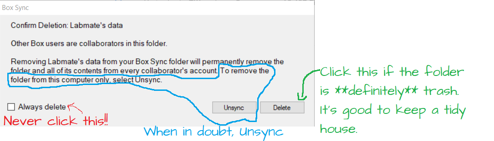

# Computers

* While the budget allows, full-time labbies (postdocs, grad students, and junior specialists) will be issued a computer that is in line with their research needs. Budget will be $1k, and it will be a Windows machine. 
* Desktops can be configured for you to remote-into the machine if you are more productive writing/analyzing data from home/coffee shop/library.  However, it will be better for lab dynamics if you are physically present in lab when possible. 

# Software / Website recommendations (all)

## Slack 
* Slack will be our lab's preferred communication tool (to keep it separate from noisy email boxes). I encourage labbies to install the Slack desktop app and smartphone apps and create an account to access [LowePowerLab.slack.com](LowePowerLab.slack.com)
* I encourage everyone to set "Quiet Hours" when Slack will not push notifications to your phone. You are not expected to respond to lab communication during non-work hours. 
* Not all channels will be default, but you can click on "Channels" to add yourself to channels. 

### Channels

* **# wall_of_failure**: 
    1. Seek troubleshooting advice, especially for lab-specific technical questions.  For general molecular biology/genetics, also consider the [labrats subreddit](reddit.com/r/labrats) or [ResearchGate](Researchgate.com).  ResearchGate seems better for searching old discussions & labrats is better for active discussion. 
    1. Poke fun at your own failures.  Failure is an essential part of research, but it is easy to forget that when reading scientific papers / listening to seminars that are the culmination of a lot of failure that eventually led to success.  To bolster our lab against **imposter syndrome**, I encourage everyone to acknowledge failures. 
* **# data_sharing**: 
    * The reciprocal of **# wall_of_failure**.  Celebrate your exiting data!  Also, provide feedback to each other on data visualization. 
* **# safety**:
    * A place to discuss safety: Identify hazards, ask safety related questions, share safety information & advice!
* **# announcements**:
    * The lab calendar will automatically post daily and weekly summaries of lab events here. 
    * Add Events to the lab Google calendar: LowePowerLab@gmail.com (ask a current lab member for the password)
        * Your birthday!
        * Relevant Seminars (please include room location in the details)
        * Lab meetings
* **# ordering**:
    * Post items that need to be ordered.  Assume it will take > 1 week for anything to arrive, so plan out early!
        * Include **product #** and **Manufacturer**
        * Whoever has the "ordering" lab duty will submit orders & mark them with a checkmark emoji. 
* **# random**:
    * This is the off topic area for jokes, memes, etc. 
* **#journal_club**:
    * Organizing journal club
    * Posting paper (1 week before the JC)
* **# general**:
    * Post lab business here: new resources, etc. 

## Electronic lab notebook -- OneNote
Tiffany strongly encourages YYYYMMDD date format because this will let computers sort it in order and it's an equal learning curve for US (MMDDYYYY) and international labbies (DDMMYYYY). 

* We are currently evaluating OneNote App (Not OneNote 2016, which will be discontinued by microsoft) as a platform for your electronic lab notebook. It's available for Windows, Macs, iPads, and Android OS. 
* I recommend reading [A quick guide for using Microsoft OneNote as an electronic laboratory notebook](https://journals.plos.org/ploscompbiol/article?id=10.1371/journal.pcbi.1006918). Consider using keywords and tags in your notebooks because OneNote's search is pretty powerful. 
* While you are transitioning from a paper-lab notebook & when you need to take paper notes -- feel free to take photographs of your notes/notebook pages & embed them into OneNote pages. The phone app is pretty great for doing this. 

## Box -- Cloud Back-Up
**You *must* back up your data**. UC Davis pays for unlimited storage through Box Sync (a Dropbox competitor). Once you have a UC Davis "Kerberos" account, you can use your UCD credentials to log into [Box at ucdavis.box.com](ucdavis.box.com). Your data is the property of the lab, and it must be backed up. You are allowed/encouraged to maintain access to your data after you leave the lab.  This will help you wrap up final manuscripts. 

1. Get Access to the "LowePowerLab - Shared" folder.
1. Create a "Lastname, Firstname - notebook" folder within it.  Set this folder to Sync to your computer(s). Use this to store all of your digital lab notebook files in a reasonably organized way.
    * Large datasets will be stored on a lab server t.b.d. 
1. Explore the shared resources in the shared folder. I encourage people to Sync the folders that start with "1-" (e.g. Images, professional development resources, etc.) and Sync relevant folders that start with "2-" (e.g. manuscripts they are co-authoring). 
    * When you add useful content to the lab Box folder, consider advertising it on the lab slack. 

### Good things about Box:
* **Version-Control** -- (Tiffany) accidentally deleted 40 pages of my PhD thesis without noticed & then saved changes.  Because I was working from a Box-synced folder, I was able to go back to the web interface of Box and download previous iterations of my thesis to find that text. 
* **Shared-Access** -- Please make all of your data accessible to the lab, but especially Tiffany. 

### Drawbacks of Box:
* It only syncs one folder. For this reason, save all of your lab material in that folder
* **Sync Speed** -- it can be slow to sync files (minutes). 
* **Multiple People Issues** 
    * If 2 people have a document open, edit it, & save their changes, box creates 2 files that a human then has to manually merge the changes. This is most likely a problem when co-writing a paper with your PI. If it's a word Doc the "Compare" feature in "Review" can cut down on how annoying this problem is. 
    * Be conscious when deleting synced files / folders(or renaming folders / moving them to a new path) on your personal computer. After you delete / move a folder, Box Sync will eventually pop up an error window (usually a few minutes later when you've in the middle of a different task). Be thoughtful about which option you choose. (Make sure you don't permanently lose data!)
    

## Benchling
* Benchling will be our lab's cloning / short DNA management software.  
    * Create an (academic) account and request access to the organization: https://benchling.com/organizations/lowepowerlab/members
    * Keep "cloning plans" in your notebook.  Once you create & validate a vector, copy it to the shared inventory. 
        * XXX to add -- best practices example of a good cloning plan. 

## Google Drive
UC Davis pays for google services accounts.  We have a "Team Drive" called the "Lowe-Power Lab Drive".  Make sure you are added to this.  This is where we keep documents that all users will want to view (and most will want to edit).

## Managing the Literature 

### Reference Management Software
They are all flawed, but nonetheless superior to manually curating citations in your papers, grants, theses, etc. This software both serves as a paper database (local, but you )

Options include Mendeley, Zotero, Endnote, and more. I encourage use of the free ones (so ... not EndNote). 

(If the lab comes up with a great solution, please update this section)

Tiffany's Mendeley approach:
1. Download all papers into a "new_papers" folder. Don't organize them.  Don't rename them unless they overwrite a different paper.
1. Set that folder as a ["Watch Folder"](https://blog.mendeley.com/2011/03/21/7-ways-to-add-documents-to-mendeley/). Mendeley will automatically import these papers.  It will attempt to parse the citation information from the pdf. You will have to correct it. 
1. Direct Mendeley to [Organize and Rename your files](https://library.uph.edu/c.php?g=441840&p=3012453) into a second folder. 

**warning**: Citations rarely import correctly into the software.  Before submitting fellowships, prelim proposals, or manuscripts, carefully proofread the citations. Correct them in the Reference Management Software (hopefully you only ever do this once per paper). 

### Recommended Reading list 
We have a hive-mind Google Doc that will morph as the lab interests ebb and flow. This document will serve as a potential starting point for new lab members to dive into the literature.  While a lot of the papers are *Ralstonia* related, we'll also put in other bacteria/microbe-interactions papers that might inspire our work.   

You can request read (part-time labbies) and edit (full-time labbies) access to the [Recommended Reading doc here](https://docs.google.com/document/d/1P-1xsSmAvdl-zBIPTzegvSQwl7Bo9lA3qmXo16owYDA/edit#heading=h.jhbq16rd80b).

## Software recommendations (full time labbies only)

### Graphpad Prism
* Graphpad Prism: Full time staff should ask Tiffany how to get an annual license. (Unfortunately, we don't currently have funding to purchase licenses for undergraduate researcher's computers).  We are currently using this software for graphing & basic statistics, but my hope is that we will develop competencies for open-source graphing and statistics (e.g. Python/Pandas/Seaborn or R).

### Affinity Designer
* Vector-based graphics software.  Way cheaper than Adobe Illustrator/Photoshop ($50 license). Lab will pay for licenses for lab issued computers.   

### Visual Studio Code (VS Code)
* Probably useful for a lot of new territory that the lab is going into. But definitely good for updating the lab Github pages. [See here](https://github.com/lowepowerlab/protocols/blob/master/git_and_github.md#set-up-a-text-editor-on-your-computer)

## Non-essential software

* [ACD Chemsketch](https://www.acdlabs.com/resources/freeware/chemsketch/) - Chemistry drawing program. (There's also a UCD license to ChemDraw, but it's a very bloated program & you probably don't need all the features.)

* [BioRender](https://biorender.com/) -- Quick biology diagrams. Unfortunately, they only export as JPGs on the free version. You should avoid JPGs for graphs / text / cartoons because of the compression.  PNG and TIFs have better compression for line-art. 

* Mac-Users: [Spectacle]: Split your screen / resume full-screen with keystroke commands. (This function is built into Windows OS)